# 🛡️ Cloud Honeypot & Centralized Wazuh SIEM SOC Lab

A production-grade, distributed threat intelligence environment designed to capture, analyze, and visualize real-world SSH brute-force attacks and malware activity. This setup pairs an isolated Google Cloud Platform (GCP) honeypot with a local, self-hosted Wazuh SIEM stack linked over an encrypted zero-trust mesh network.

---

## 🗺️ Network Topology & Architecture

```mermaid
flowchart LR
    %% External Threat Layer
    subgraph Internet ["🌐 Public Internet"]
        Attacker["🥷 External Threat Actors / Botnets"]
    end

    %% Cloud Infrastructure
    subgraph GCP ["☁️ Google Cloud Platform (GCP VM)"]
        Cowrie["🍯 Cowrie Honeypot<br/>(Docker / Port 2222)"]
        WazuhAgent["🕵️ Wazuh Agent<br/>(Log Collector)"]
        
        Cowrie -->|"JSON Logs<br/>(/var/log/cowrie)"| WazuhAgent
    end

    %% Encrypted Transport
    subgraph Tunnel ["🔒 Zero-Trust Network"]
        Tailscale["⚡ Tailscale Mesh VPN<br/>(Encrypted WireGuard)" ]
    end

    %% Local SOC Stack
    subgraph LocalSOC ["🏠 Local Server (Ubuntu Linux)"]
        subgraph DockerStack ["🐳 Wazuh Docker Environment"]
            WazuhManager["⚙️ Wazuh Manager<br/>(Custom Detection Engine)"]
            Indexer["🔍 OpenSearch Indexer<br/>(Log Storage & Search)"]
            Dashboard["📊 Wazuh Dashboard<br/>(SOC Visualization UI)"]

            WazuhManager -->|"Ingested Alerts<br/>(Port 9200)"| Indexer
            Dashboard <-->|"API Queries<br/>(Port 5000 / 9200)"| Indexer
        end
    end

    %% Connections
    Attacker -->|"SSH Brute Force<br/>(TCP Port 2222)"| Cowrie
    WazuhAgent -->|"Encrypted Log Stream<br/>(TCP Port 1514)"| Tailscale
    Tailscale --> WazuhManager

    %% Subgraph Styling
    classDef cloud fill:#e1f5fe,stroke:#0288d1,stroke-width:2px,color:#01579b;
    classDef soc fill:#e8f5e9,stroke:#388e3c,stroke-width:2px,color:#1b5e20;
    classDef tunnel fill:#fff3e0,stroke:#f57c00,stroke-width:2px,color:#e65100;
    classDef threat fill:#ffebee,stroke:#d32f2f,stroke-width:2px,color:#b71c1c;

    class GCP cloud;
    class LocalSOC soc;
    class Tunnel tunnel;
    class Internet threat;

```

## 🚀 Key Features & Technical Highlights

* **Medium-Interaction Honeypot (Cowrie):** Emulates a vulnerable Linux SSH service that traps threat actors in a fake Python shell. It accepts arbitrary credentials to capture post-exploitation commands, malware downloads, and brute-force dictionaries.
* **Zero-Trust Network Tunneling (Tailscale):** Securely routes log streams over a WireGuard-backed mesh network from GCP to the local SIEM, keeping database ports isolated from the public internet.
* **Custom Detection Engineering:** Engine-level custom rules (`local_rules.xml`) decode raw JSON logs and map attacker behavior directly to **MITRE ATT&CK Framework** techniques.
* **SIEM Alerting & Analytics:** High-severity alerting for brute-force spikes, successful unauthorized logins, and terminal reconnaissance commands.

## 🧰 Tech Stack

* **Cloud Infrastructure:** Google Cloud Platform (GCP Compute Engine - Ubuntu)
* **Honeypot Software:** Cowrie (Dockerized)
* **SIEM Platform:** Wazuh (Manager, Indexer, Dashboard) running on Docker
* **Network & Security:** Tailscale VPN (WireGuard protocol)
* **Host Operating System:** Ubuntu Server

## ⚙️ Custom SIEM Detection Rules

To parse Cowrie's custom JSON log structure and elevate events into high-priority security telemetry, custom rules were engineered in Wazuh's `local_rules.xml`:

<group name="local,cowrie,honeypot,">
  <!-- Base rule to match Cowrie JSON logs -->
  <rule id="100001" level="3">
    <decoded_as>json</decoded_as>
    <field name="eventid">^cowrie.</field>
    <description>Cowrie Honeypot: General Event</description>
  </rule>

  <!-- SSH Brute Force Failure -->
  <rule id="100002" level="8">
    <if_sid>100001</if_sid>
    <field name="eventid">^cowrie.login.failed</field>
    <description>Cowrie: Failed login attempt by $(username) using password $(password)</description>
    <group>authentication_failed,</group>
  </rule>

  <!-- SSH Login Success (Attacker Trapped in Sandbox) -->
  <rule id="100003" level="12">
    <if_sid>100001</if_sid>
    <field name="eventid">^cowrie.login.success</field>
    <description>Cowrie: SUCCESSFUL login by $(username) with password $(password)</description>
    <mitre>
      <id>T1078</id>
    </mitre>
  </rule>

  <!-- Command Execution Post-Breach -->
  <rule id="100004" level="10">
    <if_sid>100001</if_sid>
    <field name="eventid">^cowrie.command.input</field>
    <description>Cowrie: Attacker executed command: $(input)</description>
    <mitre>
      <id>T1059</id>
    </mitre>
  </rule>
</group>
